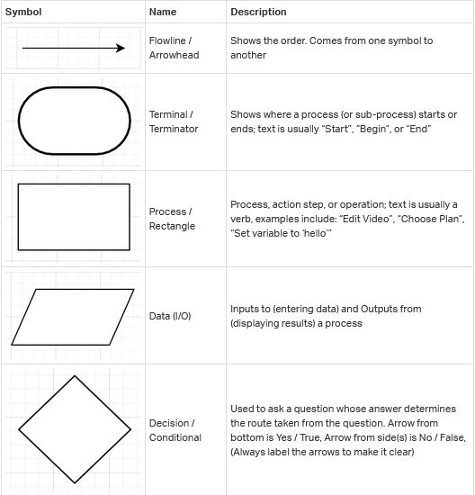
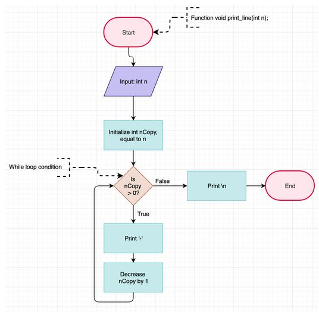

# Flowcharts

## What is a Flowchart ?

A flowchart is a type of diagram that visually represents a workflow or process using a set of symbols or icons to denote different actions/decisions/steps within the process with arrows showing the direction of the flow. Flowcharts are used across many different professions to help analyze, design, document, and/or manage a workflow or process.

## Why use a Flowchart ?

Similarly to pseudo-code, flowcharts provide another way of approaching and/or understanding a workflow. Another benefit is that, when done well, flowcharts can be understood by non-developers and by developers that do not know the language the process is written in.

## Flowchart SYmbols

This type of diagram is extremely versatile and is used across many professional fields. Due to the number of industries using flowcharts, many sets of symbols and styles have been created with a specific industry in mind. A good symbol set to use is the ISO 5807 symbol set, as they are well-known and often used in the technology industry. 

### Some commonly used ISO 5807 symbols



## An Examaple

Let’s think about Foundation task, and include a flowchart example for it:

The task instructions are as follows:
>
>    Write a function that draws a straight line in the terminal.
>
>   * Prototype: ```void print_line(int n)```;
>   * You can only use `_putchar` function to print
>   * Where `n` is the number of times the character `_` should be printed
>   * The line should end with a `\n`
>   * If `n` is 0 or less, the function should only print `\n`
>
Take a moment to write out a solution in pseudo-code.


...


No, really. It’s good practice. :) 


...


Okay. Below is what I came up with.

1. Set a variable equal `n` (`int nCopy`)
2. Set up a while loop (condition: `nCopy` is greater than 0)
3. Print `-`
4. Decrease `nCopy` by 1
5. Print `\n`

Now, using the ISO 5807 symbols from the table above, draw out a flowchart for this function.


...


No peeking !


...


Alright, does your flowchart look similar to the diagram below ?



## Bonus Info

Some good uses of flowcharts:

    * Create a flowchart before coding a task to either help create or validate pseudo-code
    * Add to a README.md to visually show how your project/process works
    * Use in a presentation to aide audience understanding
    * Your function or process is not working as expected? Create a flowchart of how it CURRENTLY is. Then, walk through the chart with some example input.

A flowchart can be as high-level or as detailed as you want. For example, you could break the flowchart above down further to include what is happening in memory. You can even create flowcharts from your everyday non-technical experiences. Choosing a movie or a place to eat could be displayed as a flow-chart!

A helpful tool to create flowcharts is draw.io. There are premade symbols for you to use and your diagrams can be saved to your Google Drive.

For more information on Flowcharts and related diagrams, a google search with simply “flowchart” can get you started. ;) 
